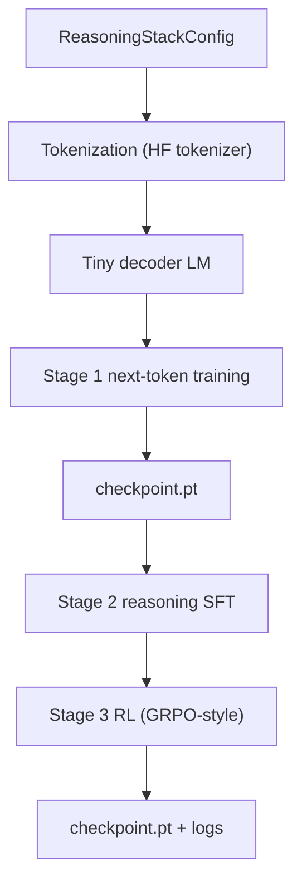
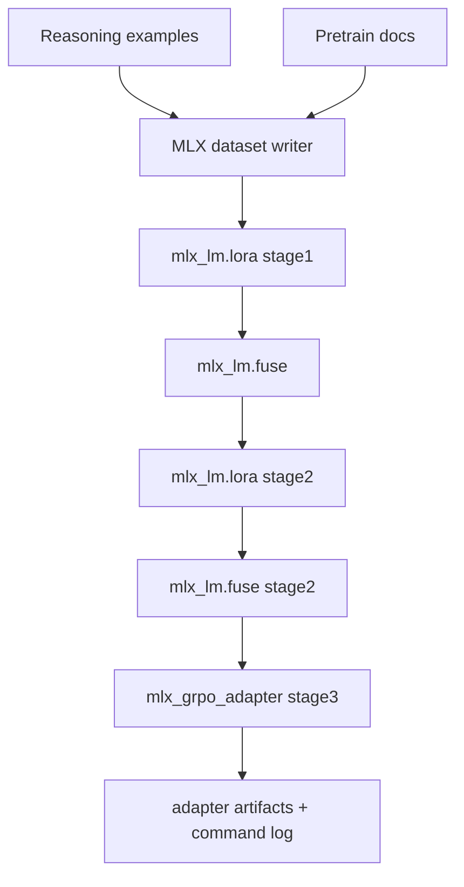

# Reasoning Stack Architecture

## Objective

Provide a local-first training architecture that can:

1. Build base language modeling capability.
2. Add explicit reasoning behavior for structured-output tasks.
3. Optimize reasoning policy with RL reward shaping.
4. Run on either CUDA (PyTorch) or MLX (Apple Silicon).

## Stage Interfaces

## Data Layer

Inputs:

- `pretrain_text_files`: plain text or task JSONL.
- `reasoning_task_files`: task records with `prompt`, `gold`, `schema_path`.

Outputs:

- Pretraining documents (text chunks).
- Reasoning SFT dataset:
  - Prompt: task prompt + system hint.
  - Completion: deterministic reasoning scaffold + gold JSON.

## CUDA Path

Key properties:

- Decoder-only Transformer built in `torch_model.py`.
- Gradient accumulation and warmup/cosine LR schedule.
- RL stage uses group sampling, reward-based advantages, and policy-gradient update.
- JSONL logs at each stage for reproducibility.

## MLX Path

Key properties:

- Uses official `mlx_lm` CLIs for practical Apple Silicon training.
- Uses repository MLX GRPO adapter for stage-3 RL optimization.
- Command plan is logged (`mlx_commands.json`) before/after execution.
- `dry_run` mode lets you verify full command sequence first.

## Quality/Verification Design

- Config validation fails early on missing paths or incompatible dimensions.
- Every run writes a machine-readable `run_summary.json`.
- Pipeline keeps stage artifacts isolated for easy rollback and comparison.
