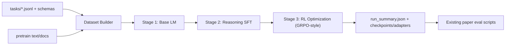
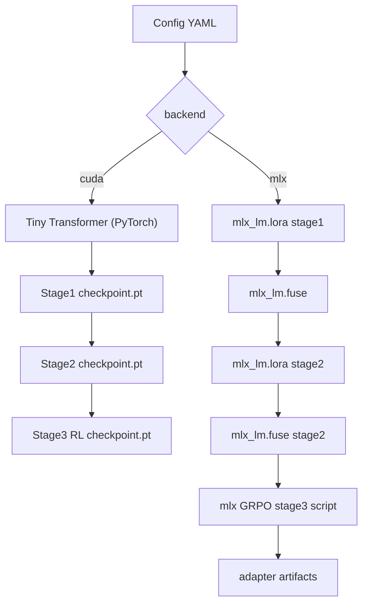

# LLM + Reasoning Stack (Local CUDA or MLX)

This module adds a clean three-stage pipeline to this repository:

1. Stage 1 builds a base language model behavior with next-token training.
2. Stage 2 turns that base model into a reasoning model with supervised `<think>...</think> + JSON` targets derived from your paper task files.
3. Stage 3 applies GRPO-style RL optimization against schema validity, correctness, latency, and stability reward terms.

It is designed to stay compatible with your existing task format in `tasks/*.jsonl` and to feed directly into your current evaluation flow.

## What You Get

- `agent_stable_slo/reasoning_stack/`:
  - Config loading/validation.
  - Data builders for pretraining text + reasoning SFT examples.
  - CUDA path: small decoder-only Transformer trained from scratch in PyTorch.
  - MLX path: official `mlx_lm` command pipeline for local Apple Silicon training.
- `configs/reasoning_stack/`:
  - `cuda_tiny.yaml` and `mlx_local.yaml` starter configs.
- `scripts/reasoning/run_reasoning_stack.py`:
  - One command to run the full pipeline.

## Architecture





## Setup

### CUDA

```bash
pip install -r requirements.txt
# Install CUDA-enabled torch matching your system
# Example (CUDA 12.1):
# pip install --index-url https://download.pytorch.org/whl/cu121 torch torchvision torchaudio
```

### MLX (Apple Silicon)

```bash
pip install -r requirements.txt
pip install mlx mlx-lm
```

## Run

### 1) CUDA three-stage training (base LM -> reasoning SFT -> RL)

```bash
python scripts/reasoning/run_reasoning_stack.py \
  --config configs/reasoning_stack/cuda_tiny.yaml
```

### 2) MLX practical flow (mlx_lm stages + MLX GRPO stage)

`configs/reasoning_stack/mlx_local.yaml` ships with `dry_run: true` so you can inspect commands first.

```bash
python scripts/reasoning/run_reasoning_stack.py \
  --config configs/reasoning_stack/mlx_local.yaml
```

Then switch `dry_run: false` to execute the MLX commands.

## Outputs

Each run writes to:

- `out/reasoning_stack/<run_name>/run_summary.json`
- Stage artifacts under:
  - `stage1_base_lm/`, `stage2_reasoning/`, and `stage3_rl/` for CUDA.
  - `mlx_stage1_*`, `mlx_stage2_*`, and `mlx_stage3_rl/` directories for MLX.

## Integrating With Paper Tests

After training, evaluate with your existing harnesses (for example `scripts/eval_t_suite.py` or `agent_stable_slo.eval`).
Use the produced checkpoint/adapter path as the model under test, then compare against your current P1/P2 metrics.

## Design Notes

- CUDA path is a true minimal-from-scratch model implementation intended to be understandable and modifiable.
- CUDA RL stage uses GRPO-style group sampling + advantage updates with your reward terms.
- MLX path stays practical: official `mlx_lm` LoRA/fuse steps plus the local MLX GRPO adapter script.
- Reasoning targets are generated from your own task files so the training distribution matches your paper benchmarks.
